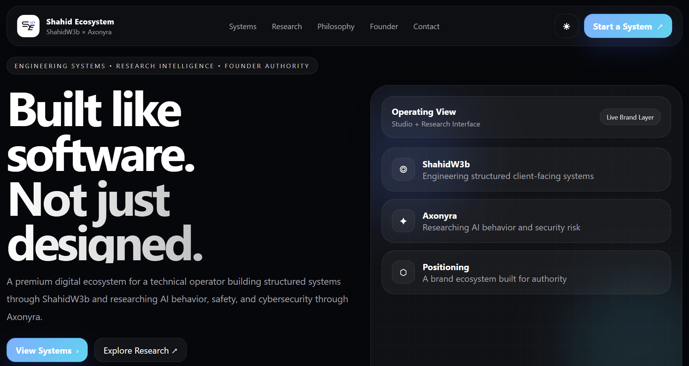

# Shahid Ecosystem – System Design & AI Research Platform

Shahid Ecosystem is a lightweight, static web platform developed using **HTML, CSS, and JavaScript**, combining **ShahidW3b (system engineering & web platforms)** and **Axonyra (AI research & cybersecurity)**.

The platform presents real-world systems including booking platforms, admin dashboards, and research interfaces, with an emphasis on **structured system design, usability, and intelligent architecture**.

---

## 📸 Preview 

<a href="https://shahid-ecosystem.vercel.app/"><strong>➥ Live Demo</strong></a>

--- 

## 🌍 Core Domains

The ecosystem operates across three primary domains:

### 💻 System Engineering (ShahidW3b)
- Web platforms and landing systems  
- Booking workflows and service pipelines  
- Admin dashboards with CRUD functionality  
- Product-oriented UI/UX architecture  
- Scalable and reusable frontend systems  

### 🧠 AI Research (Axonyra)
- Human-centered artificial intelligence  
- AI behavior, safety, and reliability  
- AI applications in education and healthcare  
- Ethical implications of intelligent systems  
- Research-driven interface design  

### 🔐 AI & Cybersecurity
- AI vulnerabilities and adversarial risks  
- Prompt injection and model manipulation  
- Secure system design principles  
- Trustworthy AI deployment strategies  

---

## 🛠️ Technologies Used

This project is intentionally built using **core web technologies** to ensure simplicity, performance, and maintainability.

- **HTML5** – semantic markup  
- **CSS3** – responsive, mobile-first layout  
- **Vanilla JavaScript** – client-side interactivity  

No external frameworks or libraries are required.

---

## 📱 Features

- Fully responsive, mobile-first design  
- Admin dashboard with booking management  
- Search, filtering, and status control system  
- Client-side data storage (LocalStorage)  
- Multi-service architecture  
- Clean and accessible user interface  
- Optimized for professional and research audiences  

---

## 📂 Project Structure

/project-root  
├── index.html  
├── style.css  
├── script.js  
├── images/   
├──logos/  
├── dashboard/  
│ └── admin_script.js  
└── README.md
